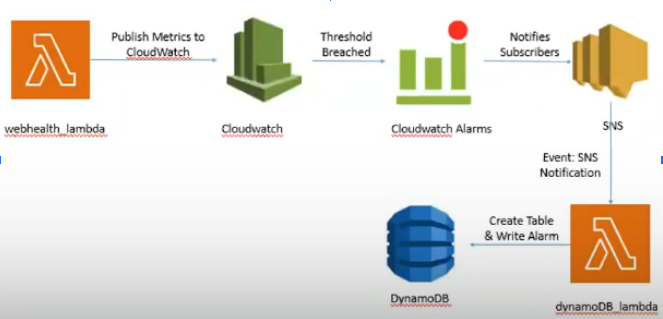

# Sprint1: Web Health Monitoring 
## Project Summary:
<br/> For Sprint 1 at SkipQ, we have designed a web health monitoring system, that periodically monitors the web health metrics (i.e. latency and availability) and then raises an alarm If any of the metric breaches a specified threshold. The rasied alarms are to be stored in a dynamodb table.
<br/>

<br/>
## GOALS
1. Create a periodic Lambda Function, that checks latency and availability of a specified url at some predefined periodic time.
2. Connect that periodic lambda function with cloud watch, by publishing the latency and availability metric to CloudWatch.
3. Generate an alarm, if the CloudWatch’s metric breaches a certain threshold.
4. Create an SNS Topic that notifies(emails) its subscribers of the breached threshold by sending them an alarm message.
5. Create A table in DynamoDB for keeping a record of the alarm messages.
6. Create another SNS subscription that triggers a lambda function to write into DynamoDB whenever an alarm is triggered.
7. Now, run this application for 4 URLS, by retrieving them from an S3 Bucket.

## SERVICES:
Services Used | Status
------------- | ------------- 
AWS Dynamodb |  :heavy_check_mark: Completed
AWS Cloudwatch | :heavy_check_mark: Completed
S3 buckets | :white_large_square: Pending
AWS lambda | :heavy_check_mark: Completed
AWS SNS | :heavy_check_mark: Completed
AWS events | :heavy_check_mark: Completed
AWS events target | :heavy_check_mark: Completed
Boto3 | :heavy_check_mark: Completed
<br/>

## Installation Guide
1. First Make Sure you have python3 installed (for this project i have used python3.6):
  - Check Python Version: python --version.
  - Install Python3 If not already installed: sudo apt-get install python3.6.
  - Set default python alias: alias python=python3. 
2. Make sure you are using aws-cli v2
  - veersion check:  aws --version
  - Download aws-cli: curl "https://awscli.amazonaws.com/awscli-exe-linux-x86_64.zip" -o "awscliv2.zip"
  - Install aws-cli: unzip awscliv2.zip
3. Clone the Git repository.
  - git clone "http url"
4. cd into the cloned repository.
  - cd ProximaCentauri
  - mkdir nimra/sprint1/
  - cdk init --language = python ()

  -Commands used to set Environment

  - The `cdk.json` file tells the CDK Toolkit how to execute your app. This project is set up like a standard Python project.  The initialization process also creates a virtualenv within this project, stored under the `.venv`directory.  To create the virtualenv it assumes that there is a `python3`
(or `python` for Windows) executable in your path with access to the `venv` package. If for any reason the automatic creation of the virtualenv fails,
you can create the virtualenv manually.

  - To manually create a virtualenv on MacOS and Linux:

```
$ python3 -m venv .venv
```

After the init process completes and the virtualenv is created, you can use the following
step to activate your virtualenv.

```
$ source .venv/bin/activate
```

If you are a Windows platform, you would activate the virtualenv like this:

```
% .venv\Scripts\activate.bat
```

Once the virtualenv is activated, you can install the required dependencies.

```
$ pip install -r requirements.txt
```

At this point you can now synthesize the CloudFormation template for this code.

```
$ cdk synth
```

To add additional dependencies, for example other CDK libraries, just add
them to your `setup.py` file and rerun the `pip install -r requirements.txt`
command.

## Useful commands

 * `cdk ls`          list all stacks in the app
 * `cdk synth`       emits the synthesized CloudFormation template
 * `cdk deploy`      deploy this stack to your default AWS account/region
 * `cdk diff`        compare deployed stack with current state
 * `cdk docs`        open CDK documentation

## Author: 
for any queries reach out at: <br/>
Name: Nimra Amin <br/>
Email: nimra.amin.s@skipq.org <br/>

Enjoy!
